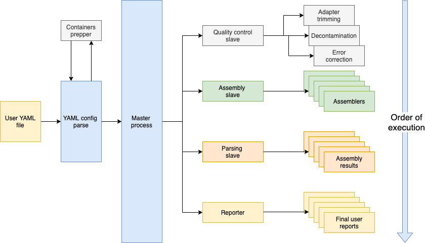

<p align="center">
    
    <br /><i>An all-encompasing bioinformatics tool for genome assembly and annotation projects</i><br>
</p>

---


### TABLE OF CONTENTS

1. [About GenoMagic](#1-about-genomagic) </br>
2. [Software Architecture](#2-software-architecture)</br>
3. [Installation](#3-installation)</br>
4. [Feedback and bug reports](#4-feedback-and-bug-reports)<br />

## 1. About GenoMagic

An all-encompasing bioinformatics tool for genome assembly and annotation projects. This project is still under development. Therefore, it is missing a *Usage* section; this will be added in the future.


## 2. Software Architecture

The overall model follows the master/slave architecture. The master is what users interact with. The users specify the files containing the contigs and what type of read they have e.g Illumina. The master takes the user's input and schedules assembly, parsing of results, and reporting, in that order. 


 
## 3. Installation

1. Clone the repository  
`$ git clone https://github.com/genomagic/genomagic.git`  

2. Build the `main.go` file  
`$ go build main.go`

## 4. Running GenoMagic

After building the binary, the program can be run as follows:
```
$ ./main
```

The available flags are:

<table>
<tr>
<th>Flag</th>
<th>Value</th>
<th>Required</th>
<th>Description</th>
</tr>
<tr>
<td><code>fastq</code></td>
<td>./path/to/sequence.fastq</td>
<td>Yes</td>
<td>Path to the raw sequencing FASTQ file</td>
</tr>
<tr>
<td><code>prep</code></td>
<td><code>true</code> / <code>false</code></td>
<td>No</td>
    <td>Whether to install necessary files background files. <i>Should be done at least once</i></td>
</tr>
</table>

## 5. Feedback and bug reports
Please submit any and all feedbacks as issues to this repository.

